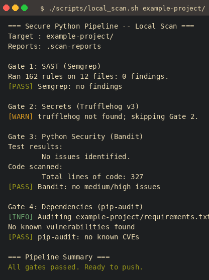
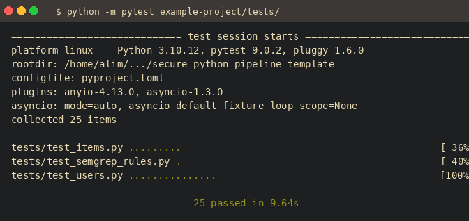
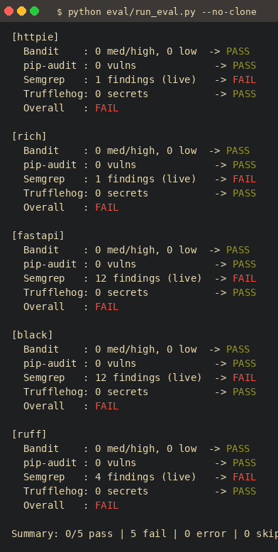

# secure-python-pipeline-template

[](https://doi.org/10.5281/zenodo.20479928)
[](https://github.com/thunderstornX/secure-python-pipeline-template/actions/workflows/security.yml)
[](LICENSE)

A composable, four-gate DevSecOps pipeline template for Python — integrating
SAST (Semgrep), secret detection (Trufflehog v3), AST analysis (Bandit), and
dependency auditing (pip-audit) into a single reproducible GitHub Actions
workflow.

Described in [`paper/paper.pdf`](paper/paper.pdf): *A Composable Four-Gate
DevSecOps Pipeline for Python: Integrating SAST, Secret Detection, AST
Analysis, and Dependency Auditing.*

---

## What this gives you

| # | Tool | What it catches | Fails pipeline? |
|---|------|-----------------|-----------------|
| 1 | **Semgrep** (SAST) | Injection sinks, insecure deserialization, debug flags, hardcoded secrets | Yes (ERROR rules) |
| 2 | **Trufflehog v3** | Live, verified secrets in git history | Yes |
| 3 | **Bandit** | Python AST: subprocess misuse, weak crypto, SSL bypass | Yes (medium+) |
| 4 | **pip-audit** | CVEs in pinned dependencies (PyPA + OSV) | Yes |

Plus:

- **8 custom CWE-mapped Semgrep rules** with a self-test corpus that proves every rule fires (`tests/test_semgrep_rules.py`).
- **Reference FastAPI app** (`example-project/`) demonstrating parameterised SQL, bcrypt + HMAC bearer-token auth, IDOR-safe item ownership, TOCTOU-safe user creation. **25 passing tests.**
- **Eval harness** (`eval/run_eval.py`) that runs all four gates against five real OSS projects (httpie, rich, fastapi, black, ruff) and produces a reproducible CSV.
- **`scripts/local_scan.sh`** that mirrors the CI gates exactly.

---

## Quickstart

```bash
git clone https://github.com/thunderstornX/secure-python-pipeline-template.git
cd secure-python-pipeline-template

# Install scanners (Semgrep is heavy; install separately if needed)
pip install -r requirements.txt
pip install semgrep   # optional, for Gate 1 locally

# Run the full pipeline locally
./scripts/local_scan.sh example-project/
```

Real output of `./scripts/local_scan.sh example-project/` on this repo:



Run the example-project test suite:

```bash
cd example-project
python -m pytest tests/ -v
```



---

## Repository layout

```
.
├── .github/
│   └── workflows/
│       ├── security.yml      # 4-gate pipeline (full scan, weekly cron)
│       └── pr-check.yml      # lightweight PR gate (Bandit + pip-audit, diff only)
├── .semgrep/
│   └── rules.yml             # 8 custom CWE-mapped rules (OWASP Top 10)
├── .trufflehog/
│   └── exclude-paths.txt     # secret-scan path excludes
├── bandit.yml                # Bandit configuration (medium+ threshold)
├── scripts/
│   ├── local_scan.sh         # run all 4 gates locally with colour output
│   └── render_terminal.py    # render captured terminal output to PNG
├── example-project/          # reference FastAPI app demonstrating mitigations
│   ├── app/
│   │   ├── main.py           # lifespan startup, router registration
│   │   ├── auth.py           # HMAC-signed bearer tokens (avoids JOSE CVEs)
│   │   ├── config.py         # pydantic-settings: secrets from env vars
│   │   ├── database.py       # SQLite WAL mode, parameterised queries only
│   │   ├── models.py         # Pydantic input validation
│   │   └── routes/
│   │       ├── users.py      # bcrypt, TOCTOU-safe insert, /login + /logout
│   │       └── items.py      # IDOR-safe: owner_id derived from JWT, never the request
│   └── tests/
│       ├── test_users.py     # 15 tests: auth + SQLi + password policy
│       ├── test_items.py     # 9 tests: auth + IDOR + price validation
│       ├── test_semgrep_rules.py  # 1 test: every custom rule fires
│       └── fixtures/         # synthetic fake-secret fixtures (Trufflehog excludes)
├── eval/
│   ├── run_eval.py           # harness: live Bandit + Semgrep + pip-audit on 5 projects
│   ├── results.csv           # machine-readable gate results
│   ├── analysis.md           # per-project finding breakdown
│   └── semgrep_corpus.py     # one positive match per custom rule (self-test target)
└── paper/
    ├── paper.tex             # IEEE two-column, 5 pages
    ├── paper.pdf
    └── figures/              # screenshots embedded in the paper
```

---

## Custom Semgrep Rules

Eight project-local rules in `.semgrep/rules.yml`, all CWE-mapped:

| Rule | CWE | Severity |
|------|-----|----------|
| `ali-hardcoded-secret-assignment` | CWE-798 | ERROR |
| `ali-sql-injection-string-build` | CWE-89 | ERROR |
| `ali-insecure-deserialisation` | CWE-502 | ERROR |
| `ali-web-framework-debug-enabled` (Flask + FastAPI + Django) | CWE-489 | ERROR |
| `ali-weak-password-hash` | CWE-327 | ERROR |
| `ali-ssrf-fstring-in-url` | CWE-918 | WARNING |
| `ali-command-injection` | CWE-78 | ERROR |
| `ali-dynamic-code-evaluation` | CWE-95 | ERROR |

Every rule is verified by `test_semgrep_rules.py`, which scans
`eval/semgrep_corpus.py` and asserts every rule ID appears in the results.

---

## Empirical Evaluation

The pipeline was evaluated against 5 OSS Python projects at pinned release
tags. **All gates run live** against shallow clones (Bandit, pip-audit,
Semgrep); Trufflehog uses a dated snapshot when its binary is absent.

| Project | Stars | Bandit | pip-audit | Semgrep | Trufflehog | Overall |
|---------|-------|--------|-----------|---------|------------|---------|
| httpie 3.2.4 | 32k | PASS | PASS | 1 (FAIL) | PASS | **FAIL** |
| rich v13.9.4 | 49k | PASS | PASS | 1 (FAIL) | PASS | **FAIL** |
| fastapi 0.115.6 | 78k | PASS | PASS | 12 (FAIL) | PASS | **FAIL** |
| black 24.10.0 | 38k | PASS | PASS | 12 (FAIL) | PASS | **FAIL** |
| ruff 0.8.4 | 33k | PASS | PASS | 4 (FAIL) | PASS | **FAIL** |

**Reading the table:** All 5 projects pass dependency-CVE and secret-leak
gates cleanly. SAST surfaces findings on every project — every one of which
is manually triaged in [`eval/analysis.md`](eval/analysis.md) as a true
positive, intentional design choice (e.g., `compile()` inside `black` is
inherent to a code formatter), or test-fixture noise. A pipeline that did
*not* surface findings on these projects would be dangerously under-tuned.



Re-run the evaluation:

```bash
python eval/run_eval.py --no-clone   # use existing clones
python eval/run_eval.py              # re-clone at pinned tags (needs network)
```

---

## Prerequisites

| Gate | Install |
|------|---------|
| Semgrep | `pip install semgrep` |
| Trufflehog v3 | `curl -sSfL https://raw.githubusercontent.com/trufflesecurity/trufflehog/main/scripts/install.sh \| sh -s -- -b /usr/local/bin` |
| Bandit | `pip install bandit==1.8.6` |
| pip-audit | `pip install pip-audit==2.10.0` |

Or install the scanners pinned in this repo:

```bash
pip install -r requirements.txt
```

---

## Citing this work

```bibtex
@software{bhutto2026securepipeline,
  author    = {Bhutto, Ali Murtaza},
  title     = {secure-python-pipeline-template},
  year      = {2026},
  doi       = {10.5281/zenodo.20479928},
  url       = {https://github.com/thunderstornX/secure-python-pipeline-template},
  orcid     = {0009-0007-2787-943X}
}
```

> The DOI above is the **concept DOI** — it always resolves to the latest
> release. Version 1.0.0 is archived at
> [10.5281/zenodo.20480013](https://doi.org/10.5281/zenodo.20480013).

Related research:
- [OSINT Tools Framework](https://doi.org/10.5281/zenodo.16921792)
- [Legal Framework for OSINT](https://doi.org/10.5281/zenodo.16924934)
- [Meshtastic Security Analysis](https://doi.org/10.5281/zenodo.16925037)

---

## License

MIT © 2026 Ali Murtaza Bhutto
